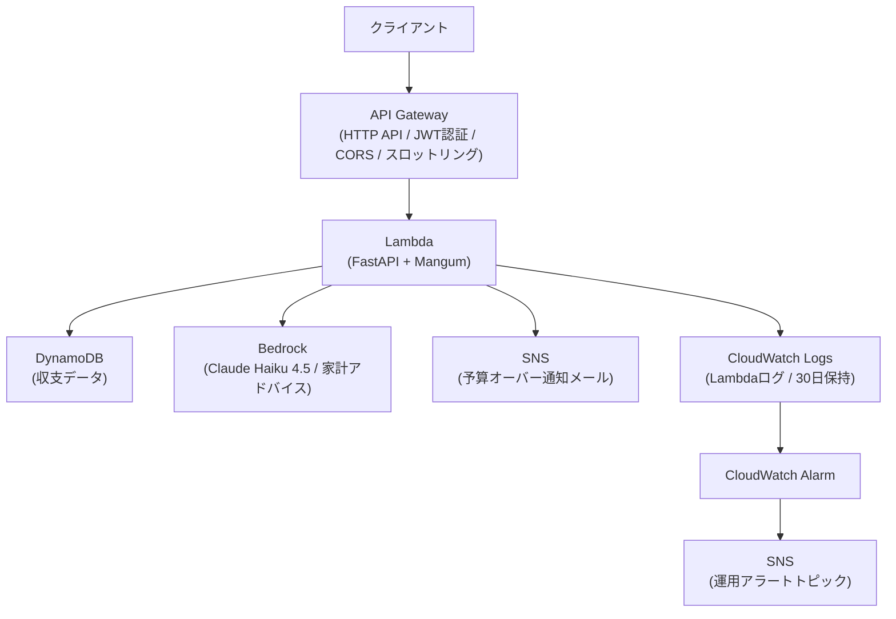

# 家計管理API

AWS Lambda + API Gateway + DynamoDB + Bedrock を使ったサーバーレス構成の家計管理APIです。
Terraformでインフラをコードで管理し、Cognito JWT認証でエンドポイントを保護しています。

---

## アーキテクチャ



---

## 使用技術

| カテゴリ | 技術 |
|---|---|
| バックエンド | Python / FastAPI / Mangum |
| インフラ | AWS Lambda / API Gateway / DynamoDB / Cognito / Bedrock / SNS / CloudWatch |
| IaC | Terraform |
| 認証 | AWS Cognito（JWT / SRP認証） |
| AI | Amazon Bedrock（Claude Haiku 4.5） |

---

## 技術選定の理由

### なぜサーバーレス（Lambda + API Gateway）か
リクエストがない時間は課金が発生しないため、ポートフォリオ用途でのコスト最適化に適しています。
また、インフラ管理の手間を省き、アプリケーション実装に集中できる点も選定理由です。

### なぜDynamoDBか
- **サーバーレスとの相性**: Lambda同様にリクエスト単位の課金でコストを抑えられる
- **データ構造の適合性**: 収支データは「ユーザーIDと日付での検索」が主なユースケースであり、複雑なJOINが不要なためNoSQLで十分対応可能
- **スケーラビリティ**: 本番運用でのデータ増加にも自動スケーリングで対応できる

> 本番環境でトランザクション処理や複雑なクエリが必要になる場合は、RDSへの移行も視野に入れています。

### なぜTerraformか
インフラをコードで管理することで、環境の再現性を担保し、`terraform apply` 一発で全リソースを構築できます。
「インフラの変更履歴をGitで管理する」という実務レベルの運用を意識しました。

### なぜCognito（JWT認証）か
自前で認証基盤を実装するよりも、AWSマネージドサービスを活用することで、セキュリティリスクを下げつつ開発コストを削減できます。
全エンドポイントにJWT認証をかけ、トークンなしではアクセスできない設計にしています。

---

## APIエンドポイント

すべてのエンドポイントはCognito JWT認証が必要です（`Authorization: Bearer <token>`）。

| メソッド | パス | 説明 |
|---|---|---|
| POST | /transactions | 収支登録（支出登録時に予算チェック・SNS通知） |
| GET | /transactions | 収支一覧取得 |
| GET | /transactions/summary | 収支集計（収入・支出・残高） |
| GET | /transactions/advice | AIによる家計アドバイス（Bedrock） |

---

## セットアップ

### 必要なもの

- Python 3.12+
- Terraform 1.0+
- AWS CLI（`terraform` profileの設定が必要）

### 1. リポジトリのクローン

```bash
git clone https://github.com/takatoseki0107/household-api.git
cd household-api
```

### 2. 仮想環境のセットアップ

```bash
python -m venv venv
source venv/bin/activate
pip install -r requirements.txt
```

### 3. terraform.tfvars の作成

```bash
cp terraform/terraform.tfvars.example terraform/terraform.tfvars
```

`terraform/terraform.tfvars` を編集して通知先メールアドレスを設定します：

```hcl
alert_email = "your-email@example.com"

# 本番環境ではフロントエンドのドメインを指定する
# allowed_origins = ["https://your-frontend-domain.com"]
```

> ⚠️ `terraform.tfvars` は `.gitignore` に含まれています。リポジトリにコミットしないでください。

### 4. Lambda パッケージのビルド

Linux 環境向けにビルドします（Lambda ランタイムが Linux のため必須）：

```bash
cd lambda
pip install -r ../requirements.txt -t . \
  --platform manylinux2014_x86_64 \
  --only-binary=:all: \
  --python-version 3.12
zip -r ../lambda.zip .
cd ..
```

### 5. インフラの構築

```bash
cd terraform
terraform init
terraform apply
```

> ⚠️ **Cognito エラーについて**: `terraform apply` 実行時に `Invalid range for token validity` エラーが表示されることがありますが、Lambda の更新には影響ありません。

`terraform apply` 完了後、以下の情報が出力されます：

```
api_gateway_url      = "https://xxxxxxxxxx.execute-api.ap-northeast-1.amazonaws.com"
cognito_user_pool_id = "ap-northeast-1_xxxxxxxxx"
cognito_client_id    = "xxxxxxxxxxxxxxxxxxxxxxxxxx"
lambda_function_name = "household-api-dev"
dynamodb_table_name  = "household-transactions"
```

### 6. SNS サブスクリプションの確認

`terraform apply` 後、`alert_email` に設定したメールアドレスに AWS から確認メールが2通届きます（予算アラート・運用アラートそれぞれ）。
メール内の **「Confirm subscription」** リンクをクリックしてサブスクリプションを有効化してください。

> ⚠️ 確認前は SNS 通知が届きません。必ず両方承認してください。

---

## 動作確認

### トークンの取得

```bash
TOKEN=$(aws cognito-idp initiate-auth \
  --auth-flow USER_PASSWORD_AUTH \
  --auth-parameters USERNAME=<ユーザー名>,PASSWORD='<パスワード>' \
  --client-id <cognito_client_id> \
  --profile terraform \
  --query 'AuthenticationResult.AccessToken' \
  --output text)
```

> ⚠️ **`ALLOW_USER_PASSWORD_AUTH` について**: この認証フローはパスワードを平文で送信するため、セキュリティリスクがあります。動作確認用途に限り一時的に有効化し、確認後は必ず削除してください。本番環境では `USER_SRP_AUTH`（パスワードをハッシュ化して送信するSRP認証）を使用することを推奨します。Terraformのデフォルト設定では `USER_SRP_AUTH` のみ有効化しており、`ALLOW_USER_PASSWORD_AUTH` はコンソールから手動で追加する運用にすることで、誤って本番環境に残るリスクを防いでいます。

### 収支の登録

```bash
curl -X POST <api_gateway_url>/transactions \
  -H "Authorization: Bearer $TOKEN" \
  -H "Content-Type: application/json" \
  -d '{"type": "expense", "amount": 3000, "category": "食費", "date": "2025-01-01"}'
```

### 一覧取得

```bash
curl <api_gateway_url>/transactions \
  -H "Authorization: Bearer $TOKEN"
```

### 収支集計

```bash
curl <api_gateway_url>/transactions/summary \
  -H "Authorization: Bearer $TOKEN"
```

### AIアドバイス取得

```bash
curl <api_gateway_url>/transactions/advice \
  -H "Authorization: Bearer $TOKEN"
```

---

## 監視

| アラーム | 条件 | 通知先 |
|---|---|---|
| Lambda エラー | 5分間で3件以上のエラー | 運用アラート SNS |
| Bedrock 呼び出し過多 | 1時間で100回超 | 運用アラート SNS |
| 予算オーバー | 支出合計が閾値（デフォルト: 10万円）を超過 | 予算アラート SNS |

CloudWatch Logs は `/aws/lambda/household-api-dev` に30日間保持されます。

---

## 開発プロセス

ブランチ運用（`feature/xxx` → `main`）とPRレビューを取り入れて開発しています。
GitHubのIssueでタスクを管理し、**Must / Should / Could** の優先度でレビューを受け、指摘対応後にmainへマージする運用です。

レビューではインラインコメントによる具体的な指摘（設計上の問題・エラーハンドリング・コスト最適化など）を受け、修正・再レビュー・Approvedの流れを実践しました。

> 📝 実際のレビューコメントと修正履歴は [Pull Requests](https://github.com/takatoseki0107/household-api/pulls?state=closed) からご確認いただけます。

### 苦労した点・工夫した点

**① AIを過信してインフラが全消えした**
実装中にAIが提示したコマンドをそのまま実行したところ、`terraform destroy` が走りAWSリソースが全て削除されてしまいました。`terraform apply` で再構築することで復旧しましたが、この経験から「AIが提示するコマンドであっても、何の意図があるコマンドなのかを自分で理解してから実行する」という習慣が身につきました。AIを活用しながらも、最終的な判断は自分で行う重要性を実感しました。

**② Bedrockは資格の知識だけでは触れなかった**
AWS MLAの資格試験でBedrockの知識はありましたが、実際に使おうとしたところモデルアクセスの申請が別途必要なことがわかり詰まりました。「テキストで知っている」と「実際に動かせる」は別物だと実感し、手を動かすことの重要性を改めて学びました。

**③ セキュリティリスクをコードで実感した**
`ALLOW_USER_PASSWORD_AUTH` の設定を実際に触ったことで、資格のテキストでは伝わらなかったセキュリティリスクの重要性をリアルに体感しました。本番環境に誤って残るリスクを防ぐため、Terraformのデフォルト設定からは外し、動作確認時のみ手動で有効化する運用にすることで、設計レベルでリスクを防ぐ意識が生まれました。

---

### テスト・CI/CDについて

**テストコード**はPytestの学習は行いましたが、今回はAPIの動作確認をcurlで手動検証する形を選びました。サーバーレス構成・認証・DynamoDB・Bedrockの統合実装を優先した判断です。テストの重要性は認識しており、今後追加実装予定です。

**CI/CD（GitHub Actions）**はTerraformによるインフラのコード管理とサーバーレス構成の設計・実装を優先したため、デプロイ自動化はスコープ外としました。OIDCを使ったGitHub ActionsからのAWSデプロイは次のステップとして学習中です。
