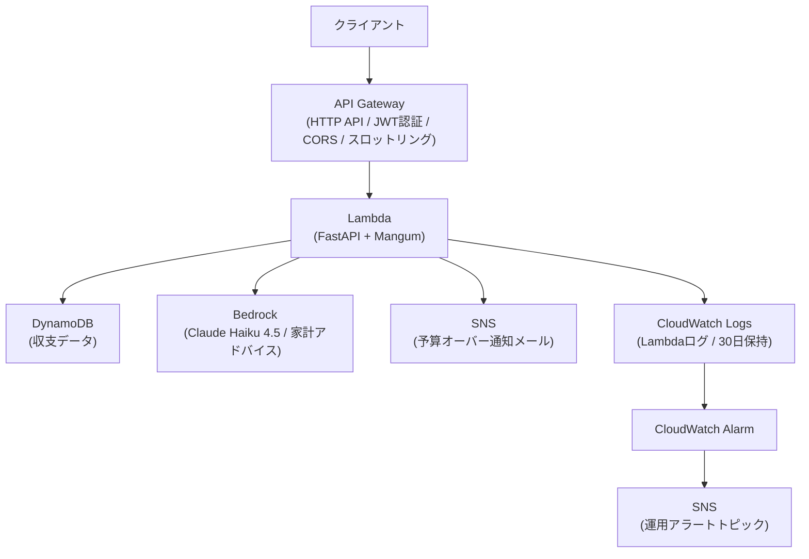

# Aibo - AI家計管理アプリ

> **AI × 家計簿 × 相棒 = Aibo**  
> AIと一緒にお金を管理する、あなたの家計の相棒アプリ

## 名前の由来

| 要素 | 意味 |
|------|------|
| **AI** | 人工知能（Artificial Intelligence） |
| **簿** | 家計簿 |
| **相棒** | 一緒に歩むパートナー |

これら3つを組み合わせて **Aibo（アイボ）** という名前が生まれました。

---

## コンセプト

家計管理は「続けること」が一番難しい。  
Aiboは、AIが収支データをもとに家計アドバイスを自動生成し、  
ユーザーが無理なく続けられる家計管理体験を提供します。

---

## 技術構成

### バックエンド（AWS）

| サービス | 役割 |
|----------|------|
| **AWS Lambda** | APIサーバー（Python / FastAPI + Mangum） |
| **API Gateway (HTTP API)** | RESTエンドポイント・CORSハンドリング |
| **Amazon Cognito** | ユーザー認証・JWTトークン発行 |
| **Amazon Bedrock** | AIアドバイス生成（Claude Haiku 4.5） |
| **Amazon DynamoDB** | 収支データ永続化 |
| **Amazon SNS** | 予算超過アラート通知 |
| **Amazon CloudWatch** | Lambdaエラー・Bedrock呼び出し監視 |
| **Terraform** | インフラのコード管理（IaC） |

### フロントエンド

| 技術 | 役割 |
|------|------|
| **React + Vite** | UIフレームワーク・開発環境 |
| **TailwindCSS** | スタイリング（テラコッタ・オレンジ系テーマ） |
| **AWS Amplify** | ホスティング・デプロイ |

---

## フロントエンド

### 技術構成
- React + Vite + TypeScript + TailwindCSS
- AWS Amplify（ホスティング・自動デプロイ）

### 画面構成
| 画面 | 説明 |
|------|------|
| ログイン・サインアップ | Cognito認証 |
| ダッシュボード | 収支サマリー・日別グラフ |
| 収支管理 | 収支の登録・一覧表示 |
| AIアドバイス | Bedrockによる家計アドバイス |

### デプロイ済みURL
https://main.d29uxcd9xeq5dr.amplifyapp.com

### 自動デプロイ
mainブランチへのpushで自動的にAmplifyがビルド・デプロイします。

---

## APIエンドポイント一覧

すべてのエンドポイントは **Cognito JWT認証** が必要です。  
`Authorization: Bearer <id_token>` ヘッダーを付与してください。

| メソッド | パス | 説明 |
|----------|------|------|
| `POST` | `/transactions` | 収支を登録する |
| `GET` | `/transactions` | 収支一覧を取得する |
| `GET` | `/transactions/summary` | 収支サマリー（合計）を取得する |
| `GET` | `/transactions/advice` | AIによる家計アドバイスを取得する（Bedrock） |

### POST /transactions - リクエスト例

```json
{
  "type": "expense",
  "amount": 5000,
  "category": "食費",
  "memo": "スーパーでの買い物",
  "date": "2026-05-03"
}
```

### GET /transactions/summary - レスポンス例

```json
{
  "income": 300000,
  "expense": 120000,
  "balance": 180000
}
```

### GET /transactions/advice - レスポンス例

```json
{
  "advice": "1. 食費が収入の15%を占めています...\n2. 今月は黒字で推移しています...\n3. 貯蓄率を上げるために..."
}
```

---

## フォルダ構成

```
aibo/
├── lambda/              # Lambda関数ソースコード（FastAPI）
│   └── main.py          # APIハンドラー
├── terraform/           # Terraformインフラ定義
│   ├── main.tf
│   ├── variables.tf
│   └── outputs.tf
├── frontend/            # Reactフロントエンド
│   ├── src/
│   └── ...
├── requirements.txt
└── README.md
```

---

## ローカル開発

### バックエンド

```bash
pip install -r requirements.txt
uvicorn lambda.main:app --reload
```

### フロントエンド

```bash
cd frontend
npm install
npm run dev
```

---

## インフラデプロイ

```bash
# Lambdaパッケージのビルド
pip install -r requirements.txt -t lambda/
cd lambda && zip -r ../lambda.zip .

# Terraformでデプロイ
cd terraform
terraform init
terraform plan -var="alert_email=your@email.com"
terraform apply -var="alert_email=your@email.com"
```

---

## 環境変数（Lambda）

| 変数名 | 説明 | デフォルト |
|--------|------|-----------|
| `SNS_TOPIC_ARN` | 予算アラート SNS Topic ARN | — |
| `BEDROCK_MODEL_ID` | BedrockモデルID | `jp.anthropic.claude-haiku-4-5-20251001-v1:0` |
| `BUDGET_THRESHOLD` | 予算上限（円） | `100000` |

---

## アーキテクチャ



---

## 技術選定の理由

### なぜサーバーレス（Lambda + API Gateway）か
リクエストがない時間は課金が発生しないため、ポートフォリオ用途でのコスト最適化に適しています。
また、インフラ管理の手間を省き、アプリケーション実装に集中できる点も選定理由です。

### なぜDynamoDBか
- **サーバーレスとの相性**: Lambda同様にリクエスト単位の課金でコストを抑えられる
- **データ構造の適合性**: 収支データは「ユーザーIDと日付での検索」が主なユースケースであり、複雑なJOINが不要なためNoSQLで十分対応可能
- **スケーラビリティ**: 本番運用でのデータ増加にも自動スケーリングで対応できる

> 本番環境でトランザクション処理や複雑なクエリが必要になる場合は、RDSへの移行も視野に入れています。

### なぜTerraformか
インフラをコードで管理することで、環境の再現性を担保し、`terraform apply` 一発で全リソースを構築できます。
「インフラの変更履歴をGitで管理する」という実務レベルの運用を意識しました。

### なぜCognito（JWT認証）か
自前で認証基盤を実装するよりも、AWSマネージドサービスを活用することで、セキュリティリスクを下げつつ開発コストを削減できます。
全エンドポイントにJWT認証をかけ、トークンなしではアクセスできない設計にしています。

---

## 開発プロセス

ブランチ運用（`feature/xxx` → `main`）とPRレビューを取り入れて開発しています。
GitHubのIssueでタスクを管理し、**Must / Should / Could** の優先度でレビューを受け、指摘対応後にmainへマージする運用です。

レビューではインラインコメントによる具体的な指摘（設計上の問題・エラーハンドリング・コスト最適化など）を受け、修正・再レビュー・Approvedの流れを実践しました。

> 📝 実際のレビューコメントと修正履歴は [Pull Requests](https://github.com/takatoseki0107/aibo/pulls?state=closed) からご確認いただけます。

### 苦労した点・工夫した点

**① AIを過信してインフラが全消えした**
実装中にAIが提示したコマンドをそのまま実行したところ、`terraform destroy` が走りAWSリソースが全て削除されてしまいました。`terraform apply` で再構築することで復旧しましたが、この経験から「AIが提示するコマンドであっても、何の意図があるコマンドなのかを自分で理解してから実行する」という習慣が身につきました。AIを活用しながらも、最終的な判断は自分で行う重要性を実感しました。

**② Bedrockは資格の知識だけでは触れなかった**
AWS MLAの資格試験でBedrockの知識はありましたが、実際に使おうとしたところモデルアクセスの申請が別途必要なことが分からず、そこで詰まりました。「テキストで知っている」と「実際に動かせる」は別物だと実感し、手を動かすことの重要性を改めて学びました。

**③ セキュリティリスクをコードで実感した**
`ALLOW_USER_PASSWORD_AUTH` の設定を実際に触ったことで、資格のテキストでは伝わらなかったセキュリティリスクの重要性をリアルに体感しました。本番環境に誤って残るリスクを防ぐため、Terraformのデフォルト設定からは外し、動作確認時のみ手動で有効化する運用にすることで、設計レベルでリスクを防ぐ意識が生まれました。

---

## テスト・CI/CDについて

**テストコード**はPytestの学習は行いましたが、今回はAPIの動作確認をcurlで手動検証する形を選びました。サーバーレス構成・認証・DynamoDB・Bedrockの統合実装を優先した判断です。テストの重要性は認識しており、特に予算計算ロジックや
Bedrock連携部分から順次Pytestによる単体テストを
追加実装予定です。

手動検証では主に以下を確認しました：
- Cognito JWT認証の正常系・異常系（トークンなし・期限切れ）
- DynamoDBへの収支登録・一覧取得・集計の動作
- 予算超過時のSNS通知メール送信
- BedrockによるAIアドバイスの生成・レスポンス確認

**CI/CD（GitHub Actions）**はTerraformによるインフラのコード管理とサーバーレス構成の設計・実装を優先したため、デプロイ自動化はスコープ外としました。OIDCを使ったGitHub ActionsからのAWSデプロイは次のステップとして学習中です。

---

## 監視

| アラーム | 条件 | 通知先 |
|---|---|---|
| Lambda エラー | 5分間で3件以上のエラー | 運用アラート SNS |
| Bedrock 呼び出し過多 | 1時間で100回超 | 運用アラート SNS |
| 予算オーバー | 支出合計が閾値（デフォルト: 10万円）を超過 | 予算アラート SNS |

CloudWatch Logs は `/aws/lambda/household-api-dev` に30日間保持されます。
