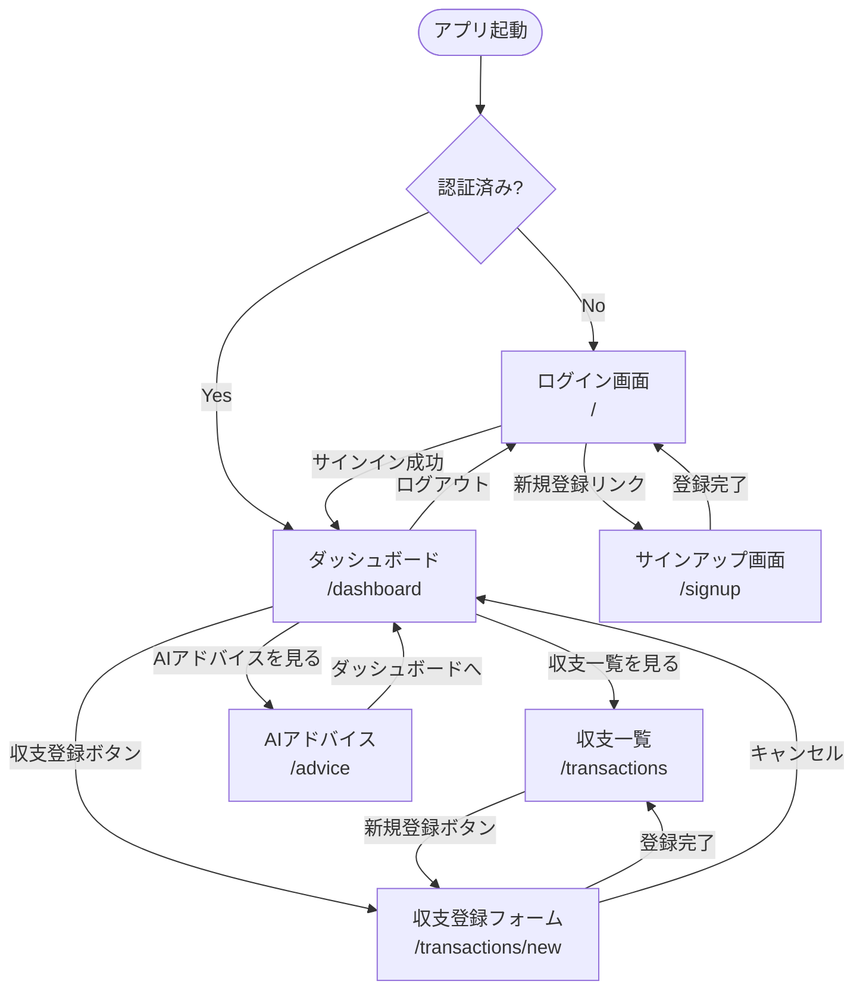

# Aibo - 要件定義書

---

## 1. プロジェクト概要

**アプリ名**: Aibo（アイボ）

**コンセプト**:
> AI × 家計簿 × 相棒 = AIと一緒にお金を管理する、あなたの家計の相棒アプリ

**名前の由来**:

| 要素 | 意味 |
|------|------|
| **AI** | 人工知能（Artificial Intelligence） |
| **簿** | 家計簿 |
| **相棒** | 一緒に歩むパートナー |

家計管理は「続けること」が一番難しい。Aiboは、AIが実際の収支データをもとにアドバイスを自動生成することで、「記録して終わり」ではなく「改善につながる家計管理」を実現します。

---

## 2. 対象ユーザー

- **家計管理をしたいが続かない人**
  - 毎月記録しようとするが三日坊主になってしまう
  - 家計簿アプリを入れたものの使いこなせていない
  - 収支を把握したいが何から始めればいいかわからない

- **AIのアドバイスをもとに家計を改善したい人**
  - 数字を見ても何をすればいいかわからない
  - 客観的な視点からアドバイスをもらいたい
  - 節約や貯蓄率向上のヒントが欲しい

---

## 3. 機能一覧

### Must（必須機能）

| # | 機能 | 説明 |
|---|------|------|
| M-1 | ログイン・認証 | Cognito SRP認証によるサインアップ・サインイン |
| M-2 | 収支登録 | 収入・支出の種別・金額・カテゴリ・メモ・日付を登録 |
| M-3 | 収支一覧表示 | 登録した収支をリスト形式で表示 |
| M-4 | 収支サマリー | 収入合計・支出合計・残高を表示 |
| M-5 | AIアドバイス | 直近3ヶ月の収支データをもとにBedrockがアドバイスを生成 |

### Should（できれば実装）

| # | 機能 | 説明 |
|---|------|------|
| S-1 | 月別絞り込み | 収支一覧を月単位でフィルタリング |
| S-2 | カテゴリ絞り込み | 収支一覧をカテゴリ（食費・交通費など）でフィルタリング |

### Could（余裕があれば実装）

| # | 機能 | 説明 |
|---|------|------|
| C-1 | グラフ表示 | 月別収支の棒グラフ・カテゴリ別の円グラフ |
| C-2 | 予算設定 | 月次予算の設定と進捗表示 |
| C-3 | 超過通知 | 予算超過時のSNS通知（バックエンド実装済み） |

---

## 4. 画面一覧と機能詳細

### 4-1. ログイン画面 `/`

**目的**: ユーザー認証

| 要素 | 詳細 |
|------|------|
| メールアドレス入力 | Cognitoに登録したメールアドレス |
| パスワード入力 | 最小12文字・大文字小文字数字記号を含む |
| サインインボタン | Cognito SRP認証を実行、IDトークンを取得 |
| サインアップリンク | 新規登録フローへ遷移 |

認証後はIDトークンをローカルストレージまたはメモリに保持し、以降のAPIリクエストに `Authorization: Bearer <id_token>` として付与する。

---

### 4-2. ダッシュボード `/dashboard`

**目的**: 収支状況の一目把握

| 要素 | 詳細 |
|------|------|
| 収支サマリーカード | 収入合計・支出合計・残高を3枚のカードで表示（`GET /transactions/summary`） |
| 月別グラフ（Could） | 月ごとの収入・支出棒グラフ |
| 最近の取引リスト | 直近5〜10件の収支を日付降順で表示（`GET /transactions`） |
| AIアドバイスバナー | 最新のAIアドバイスをサマリー表示（`GET /transactions/advice`） |
| 収支登録ボタン | 収支登録モーダルまたは登録画面へ遷移 |

---

### 4-3. 収支一覧画面 `/transactions`

**目的**: 収支の確認・管理

| 要素 | 詳細 |
|------|------|
| 収支リスト | 日付・種別（収入/支出）・カテゴリ・金額・メモを表示（`GET /transactions`） |
| 月別フィルター（Should） | 対象月を選択して絞り込み |
| カテゴリフィルター（Should） | カテゴリを選択して絞り込み |
| 新規登録ボタン | 収支登録フォームを表示 |

---

### 4-4. 収支登録フォーム（モーダルまたは `/transactions/new`）

**目的**: 新しい収支の入力

| 入力項目 | 型 | 必須 | 説明 |
|----------|----|------|------|
| 種別 | `"income"` / `"expense"` | ✓ | 収入・支出の選択 |
| 金額 | 整数 | ✓ | 1以上の正の整数（円） |
| カテゴリ | 文字列 | ✓ | 食費・交通費・給与など |
| メモ | 文字列 | — | 任意の備考 |
| 日付 | `YYYY-MM-DD` | ✓ | 収支が発生した日付 |

送信先: `POST /transactions`

---

### 4-5. AIアドバイス画面 `/advice`

**目的**: AIによる家計改善提案の確認

| 要素 | 詳細 |
|------|------|
| アドバイス本文 | Bedrockが生成した3点のアドバイスを表示（`GET /transactions/advice`） |
| 対象期間表示 | 「直近3ヶ月のデータをもとに分析」と明示 |
| 再生成ボタン | APIを再度呼び出してアドバイスを更新 |
| 収支サマリー（参考） | アドバイスの根拠となった収入・支出・残高を表示 |

データが0件の場合: `"まずは収支を登録してみましょう"` というメッセージを表示。

---

## 5. 画面遷移図



---

## 6. API仕様

ベースURL: `https://<api-id>.execute-api.ap-northeast-1.amazonaws.com`

認証: 全エンドポイントに **Cognito JWT認証** が必要
ヘッダー: `Authorization: Bearer <id_token>`

---

### POST /transactions

収支を登録する。支出登録時は予算チェックを行い、閾値超過時はSNSで通知する。

**リクエストボディ**

```json
{
  "type": "expense",
  "amount": 5000,
  "category": "食費",
  "memo": "スーパーでの買い物",
  "date": "2026-05-03"
}
```

| フィールド | 型 | 必須 | 説明 |
|------------|----|------|------|
| `type` | `"income"` \| `"expense"` | ✓ | 収入・支出の種別 |
| `amount` | integer | ✓ | 金額（円） |
| `category` | string | ✓ | カテゴリ名 |
| `memo` | string | — | 備考（省略時は空文字） |
| `date` | string (`YYYY-MM-DD`) | ✓ | 収支日付 |

**レスポンス** `200 OK`

```json
{
  "message": "登録しました",
  "transactionId": "xxxxxxxx-xxxx-xxxx-xxxx-xxxxxxxxxxxx"
}
```

---

### GET /transactions

全収支一覧を取得する（DynamoDBのページネーション対応済み）。

**レスポンス** `200 OK`

```json
{
  "transactions": [
    {
      "userId": "cognito-sub-uuid",
      "transactionId": "xxxxxxxx-xxxx-xxxx-xxxx-xxxxxxxxxxxx",
      "type": "expense",
      "amount": 5000,
      "category": "食費",
      "memo": "スーパーでの買い物",
      "date": "2026-05-03",
      "createdAt": "2026-05-03T10:00:00+00:00"
    }
  ]
}
```

---

### GET /transactions/summary

全収支の合計を取得する。

**レスポンス** `200 OK`

```json
{
  "income": 300000,
  "expense": 120000,
  "balance": 180000
}
```

---

### GET /transactions/advice

直近3ヶ月の収支データをもとに、BedrockがAIアドバイスを3点生成して返す。

**レスポンス** `200 OK`

```json
{
  "advice": "1. 食費が収入の15%を占めています...\n2. 今月は黒字で推移しています...\n3. 貯蓄率を上げるために..."
}
```

データが0件の場合:

```json
{
  "advice": "まずは収支を登録してみましょう"
}
```

---

**エラーレスポンス共通**

| ステータス | 説明 |
|-----------|------|
| `401 Unauthorized` | JWTトークンなし・期限切れ |
| `500 Internal Server Error` | DynamoDB / Bedrock / SNS の処理失敗 |

---

## 7. インフラ構成

> ※ AWSリソース名は開発初期の `household-***` のまま運用中。
> アプリ名変更（→ Aibo）に伴い、次回インフラ再構築時に `aibo-***` へ統一予定。

### AWSリソース一覧

| リソース | 名前 | 設定 |
|----------|------|------|
| **DynamoDB** | `household-transactions` | PAY_PER_REQUEST・PITR有効 |
| **Lambda** | `household-api-{env}` | Python 3.12・512MB・タイムアウト30秒 |
| **API Gateway** | `household-api-{env}` | HTTP API・`$default`ステージ・自動デプロイ |
| **Cognito User Pool** | `household-user-pool-{env}` | メール確認・SRP認証・パスワード最小12文字 |
| **Cognito App Client** | `household-app-client` | SRP認証・IDトークン60分・リフレッシュ30日 |
| **SNS Topic** | `household-budget-alert-{env}` | 予算超過通知（メール） |
| **SNS Topic** | `household-ops-alert-{env}` | 運用アラート通知（メール） |
| **CloudWatch Logs** | `/aws/lambda/household-api-{env}` | 保持期間30日 |
| **CloudWatch Alarm** | `household-lambda-errors-{env}` | 5分で3件超エラー → 運用SNS通知 |
| **CloudWatch Alarm** | `household-bedrock-invocations-{env}` | 1時間100回超 → 運用SNS通知 |

### DynamoDBテーブル設計

| キー | 型 | 説明 |
|------|----|------|
| `userId` (PK) | String | Cognitoの `sub`（ユーザーID） |
| `transactionId` (SK) | String | UUID v4 |

### API Gatewayスロットリング

| 設定 | 値 |
|------|----|
| バーストリミット | 100 req/s |
| レートリミット | 50 req/s |

### CORS設定

`terraform/variables.tf` の `allowed_origins` で管理。開発時は `localhost`、本番はAmplifyのドメインを指定。

### Lambdaランタイム環境変数

| 変数名 | 説明 | デフォルト |
|--------|------|-----------|
| `SNS_TOPIC_ARN` | 予算アラート SNS Topic ARN | — |
| `BEDROCK_MODEL_ID` | Bedrock推論プロファイルID | `jp.anthropic.claude-haiku-4-5-20251001-v1:0` |
| `BUDGET_THRESHOLD` | 予算上限（円） | `100000` |

---

## 8. 非機能要件

### 認証・セキュリティ

- 全APIエンドポイントにCognito JWT認証を適用（トークンなしでは `401` を返す）
- 認証フローはSRP（`ALLOW_USER_SRP_AUTH`）を使用。`USER_PASSWORD_AUTH` は動作確認時のみ手動で有効化し、本番環境には残さない
- `terraform.tfvars`（メールアドレス等）は `.gitignore` でリポジトリに含めない

### レスポンシブ対応

- PC・スマートフォン両対応
- TailwindCSSのレスポンシブプレフィックス（`sm:` / `md:` / `lg:`）を使用

### CORS

- API GatewayにCORS設定済み（`GET` / `POST` / `PUT` / `DELETE` / `OPTIONS`）
- フロントエンドのオリジンを `allowed_origins` で明示的に許可

### パフォーマンス

- Lambdaメモリ: 512MB・タイムアウト: 30秒
- DynamoDB: PAY_PER_REQUEST（オートスケーリング）
- API Gatewayスロットリング: バースト100 req/s・レート50 req/s

---

## 9. 今後の拡張予定

| 優先度 | 内容 | 概要 |
|--------|------|------|
| 高 | テストコード追加 | Pytestによるユニットテスト・統合テストの実装 |
| 高 | CI/CD（GitHub Actions） | OIDCを使ったAWSへの自動デプロイパイプライン構築 |
| 中 | グラフ機能強化 | 月別収支棒グラフ・カテゴリ別円グラフの実装 |
| 中 | 月別・カテゴリ絞り込み | 収支一覧のフィルタリング機能（フロントエンド実装） |
| 低 | 予算設定UI | 月次予算の設定・進捗バーの表示 |
| 低 | 収支削除・編集 | 登録済み収支の修正・削除機能 |

---

## フロントエンド要件

### 画面一覧
| 画面名 | URL | 説明 |
|--------|-----|------|
| ランディング・ログイン | / | アプリ紹介・ログインフォーム |
| サインアップ | /signup | Cognitoユーザー登録・確認コード認証 |
| ダッシュボード | /dashboard | 収支サマリー・日別グラフ |
| 収支管理 | /transactions | 収支登録・一覧表示 |
| AIアドバイス | /advice | Bedrockによる家計アドバイス |

### 認証フロー
- サインアップ → 確認コードメール → ログイン
- 全画面（ランディング除く）はCognito JWT認証必須
- 未認証でアクセスした場合はログイン画面にリダイレクト

### 技術要件
- React + Vite + TypeScript + TailwindCSS
- AWS Amplifyでホスティング・自動デプロイ
- mainブランチへのpushで自動デプロイ
